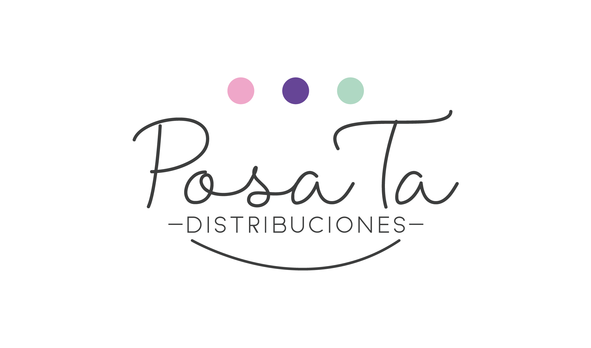

# POSATA COSMETICS



**Posata Cosmetics** es una plataforma e-commerce para la venta de cosméticos, productos para uñas y cabello a nivel nacional (Colombia). Funciona como catálogo digital y tienda en línea con pasarela de pagos integrada.

**Marcas disponibles:** ANI-K · BLOOMSHELL · MILAGROS · LATTIN NAILS · LA POCIÓN · RITUAL BOTÁNICO

---

## Estado Actual del Proyecto

| Fase | Nombre | Estado |
|------|--------|--------|
| **1** | Documentación y Maquetación (HTML + CSS) | 🟡 En progreso |
| **2** | Integración Frontend (React + TypeScript) | ⚪ Pendiente |
| **3** | Integración Backend (Firebase + MercadoPago + Envíos) | ⚪ Pendiente |

**Subfase actual:** 1.1 — Documentación Completa ✅

> Para ver el detalle de todas las fases y subfases, consulta [Fases del Proyecto](docs/fases_del_proyecto.md).

---

## Stack Tecnológico

| Capa | Tecnología |
|------|-----------|
| Maquetación | HTML5 semántico |
| Estilos | CSS puro (Custom Properties, sin frameworks) |
| Frontend | React 18+ con TypeScript |
| Bundler | Vite |
| Base de datos | Firebase Firestore |
| Autenticación | Firebase Auth (opcional para el usuario) |
| Almacenamiento | Firebase Storage |
| Hosting | Firebase Hosting |
| Pagos | MercadoPago |
| Envíos | API de transportadora colombiana |

---

## Funcionalidades Principales

- **Home:** Productos recomendados (más vendidos)
- **Catálogo:** Filtros por marca, categoría, palabras clave y precio
- **Marcas:** Dropdown con las 6 marcas disponibles
- **Carrito de compras:** Agregar, modificar cantidades, eliminar
- **Checkout:** Datos de envío + cálculo automático de tarifa por departamento + pago con MercadoPago
- **Autenticación opcional:** Registro con email o Google, historial de pedidos
- **Sobre Nosotros:** Historia y valores de Posata
- **Contacto:** WhatsApp como soporte técnico
- **Seguimiento de pedidos:** Consulta de estado con número de guía

> Para ver el alcance completo, consulta [Alcance del Proyecto](docs/alcance_del_proyecto.md).

---

## Decisiones Tomadas

| # | Decisión | Detalle |
|---|----------|---------|
| 1 | País de operación: **Colombia** | Moneda COP, departamentos para envíos |
| 2 | CSS puro (sin Bootstrap/Tailwind) | Enfoque de aprendizaje, control total |
| 3 | MercadoPago para pagos | Mayor cobertura de medios de pago en Colombia |
| 4 | Firebase Auth opcional | El usuario puede comprar como invitado |
| 5 | Sin panel de administración | Gestión directa desde Firebase Console |
| 6 | API de transportadora para envíos | Cálculo automático de tarifas (fallback con tabla fija) |
| 7 | Fases incrementales | HTML/CSS → React/TS → Firebase (enfoque de aprendizaje) |
| 8 | Vite como bundler | Más rápido que CRA, mejor DX |
| 9 | Context API para estado global | Suficiente para el tamaño del proyecto |

> Para ver las decisiones técnicas detalladas, consulta [Arquitectura del Proyecto](docs/arquitectura_del_proyecto.md#9-decisiones-técnicas-documentadas).

---

## Documentación

| Documento | Descripción |
|-----------|-------------|
| [Alcance del Proyecto](docs/alcance_del_proyecto.md) | Funcionalidades, usuarios, restricciones y criterios de aceptación |
| [Arquitectura del Proyecto](docs/arquitectura_del_proyecto.md) | Stack, estructura de archivos, modelo de datos, integraciones |
| [Sistema de Diseño](docs/sistema_de_diseño.md) | Colores, tipografía, espaciado, componentes UI, breakpoints |
| [Fases del Proyecto](docs/fases_del_proyecto.md) | Plan detallado con subfases, tareas y estado de cada una |

---

## Estructura del Proyecto (Fase 1)

```
posata-cosmetics/
├── docs/                    # Documentación completa
│   ├── alcance_del_proyecto.md
│   ├── arquitectura_del_proyecto.md
│   ├── fases_del_proyecto.md
│   └── sistema_de_diseño.md
├── assets/images/           # Imágenes (productos, banners, marcas)
├── css/                     # Hojas de estilo
│   ├── reset.css
│   ├── variables.css
│   ├── global.css
│   ├── components/          # Estilos por componente
│   └── pages/               # Estilos por página
├── pages/                   # Páginas HTML
├── Logo.png
└── README.md
```

> Para ver la estructura completa de todas las fases, consulta [Arquitectura del Proyecto](docs/arquitectura_del_proyecto.md#2-estructura-de-archivos).

---

## Regla de Actualización del README

> **IMPORTANTE:** Este README debe actualizarse cada vez que:
> - Se complete una subfase del proyecto
> - Se tome una decisión técnica o de negocio relevante
> - Cambie el estado de alguna fase
> - Se agregue un nuevo documento a `docs/`
>
> El README es el **punto de entrada** a toda la documentación. Debe reflejar el estado real del proyecto en todo momento, con referencias a los documentos específicos para más detalle.
